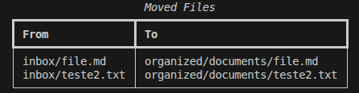

# Python File Organizer

A small automation project using `watchdog`, `pathlib`, and SQLite.

It watches an `inbox/` folder. When a file appears, the script moves it into `organized/` based on the file extension.

 

## Install

```bash
cd python-file-organizer
python -m venv .venv
source .venv/bin/activate
pip install -e .
```

## Process Existing Files Once

```bash
file-organizer organize-once
```

## Watch For New Files

```bash
file-organizer watch
```

Then, in another terminal, create test files:

```bash
touch inbox/photo.jpg
touch inbox/notes.txt
touch inbox/archive.zip
```

The files will be moved to:

```txt
organized/images/photo.jpg
organized/documents/notes.txt
organized/archives/archive.zip
```

## View Move History

```bash
file-organizer history
file-organizer history --limit 5
```

Each moved file is saved in a local SQLite database called `organizer.db`.

## Custom Folders

```bash
file-organizer watch --source ~/Downloads --target ~/Organized
file-organizer organize-once --source ./inbox --target ./organized
```

## What It Shows

- `watchdog`: listens for filesystem events.
- `pathlib`: handles paths in a clean, cross-platform way.
- `sqlite3`: stores a small move history.
- `rich`: prints friendly logs and tables.
